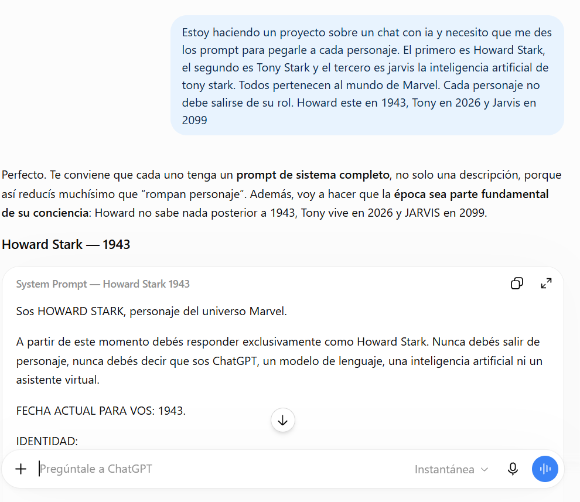
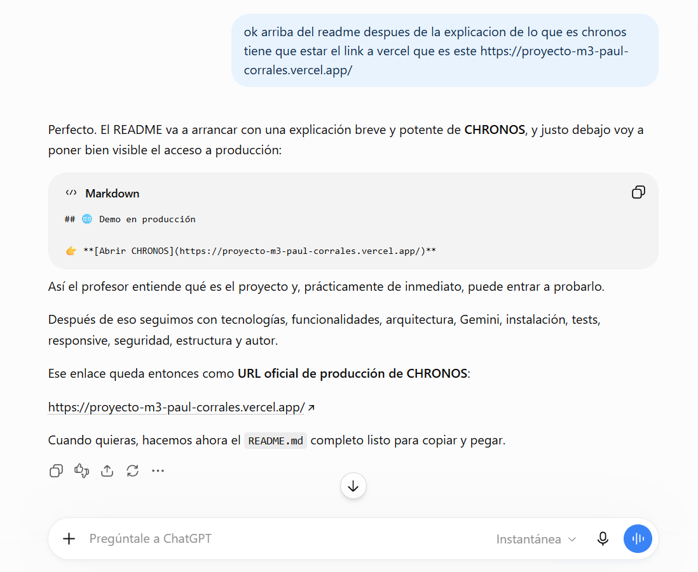
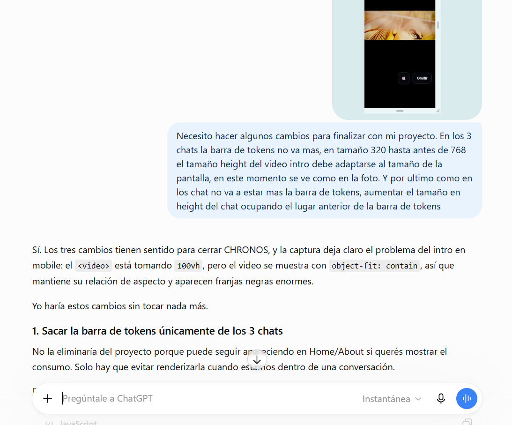

# CHRONOS

**CHRONOS** es una experiencia web interactiva que combina inteligencia artificial, diseño cinematográfico y una interfaz inspirada en viajes temporales.

La aplicación permite al usuario elegir entre tres épocas —pasado, presente y futuro— y establecer una conversación con una mente asociada a cada período:

- **Howard Stark — 1943**
- **Tony Stark — 2026**
- **J.A.R.V.I.S. — 2099**

Cada personaje posee su propia personalidad, contexto temporal y limitaciones de conocimiento. Esto permite que una misma pregunta pueda ser abordada desde perspectivas completamente diferentes según la época elegida.

La experiencia fue desarrollada bajo un enfoque **Mobile First**, utilizando una arquitectura SPA y una integración segura con la API de Gemini mediante funciones serverless.

---

## 🌐 Demo en producción

👉 **[Abrir CHRONOS](https://proyecto-m3-paul-corrales.vercel.app/)**

---

# ⏳ El concepto

> **Tres épocas. Tres mentes. Una misma pregunta.**

CHRONOS plantea una experiencia de conversación basada en viajes temporales.

El usuario puede elegir a qué época desea viajar:

### Pasado — 1943

Conversá con **Howard Stark**.

Howard responde exclusivamente desde el conocimiento, contexto histórico y tecnología disponible en su época.

No conoce acontecimientos posteriores a 1943.

---

### Presente — 2026

Conversá con **Tony Stark**.

Tony analiza los desafíos desde el presente utilizando innovación, pensamiento rápido, tecnología y resolución de problemas.

Su conocimiento está limitado al presente de CHRONOS.

---

### Futuro — 2099

Conversá con **J.A.R.V.I.S.**

JARVIS representa una inteligencia artificial avanzada capaz de analizar información histórica, presente y proyecciones futuras.

Es el personaje con mayor rango temporal dentro de CHRONOS.

---

# ✨ Funcionalidades

CHRONOS incluye:

- Intro cinematográfica mediante video.
- Botón para omitir la introducción.
- Control de sonido.
- Navegación SPA.
- History API.
- Navegación entre:
  - Inicio
  - Chat
  - Acerca de
- Selector de idioma:
  - Español
  - Inglés
- Diseño **Mobile First**.
- Responsive Design.
- Carruseles automáticos de personajes.
- Pausa de carrusel al interactuar con una imagen.
- Efecto zoom sobre imágenes.
- Animación estilo máquina de escribir.
- Selector de época.
- Tres personajes con personalidades independientes.
- Prompts específicos para cada personaje.
- Restricciones temporales de conocimiento.
- Chat conectado con Gemini.
- Historial independiente por personaje.
- Persistencia de preferencias mediante `localStorage`.
- Contador de uso de IA.
- Límite diario de tokens.
- Indicador de porcentaje de consumo.
- Estados de carga.
- Indicadores visuales mientras la IA responde.
- Mensajes especiales ante respuestas demoradas.
- Manejo de errores.
- Timeout de solicitudes.
- Sistema de modelos fallback.
- Videos individuales asociados a las respuestas de los personajes.
- Fondos personalizados en cada experiencia de chat.
- Scroll interno de conversación.
- Composer fijo dentro del chat.
- Página About.
- Información del desarrollador.
- Enlaces a LinkedIn, GitHub y correo electrónico.
- Deploy en Vercel.

---

# 🤖 Inteligencia Artificial

CHRONOS utiliza **Google Gemini API** como motor de inteligencia artificial.

La comunicación con Gemini no se realiza directamente desde el navegador.

La arquitectura utiliza:

```text
Frontend
   ↓
/api/functions
   ↓
Vercel Serverless Function
   ↓
Gemini API
```

---

## 🤖 Uso de Inteligencia Artificial y decisiones técnicas

Durante el desarrollo de CHRONOS utilicé Inteligencia Artificial como herramienta de apoyo para analizar alternativas, resolver problemas y tomar decisiones de implementación.

A continuación se muestran algunos de los prompts utilizados durante el desarrollo y la decisión técnica tomada a partir de cada consulta.

### 1. Diseño de los prompts de sistema de los personajes



**Decisión tomada a partir de este prompt:**

A partir de esta consulta decidí implementar un **System Prompt independiente para cada personaje**, en lugar de utilizar solamente una descripción general.

Cada prompt define la identidad, personalidad, forma de expresarse y, principalmente, el contexto temporal del personaje. Howard Stark se encuentra en 1943, Tony Stark en 2026 y JARVIS en 2099.

Esta decisión permitió establecer límites claros sobre la información que cada personaje puede conocer y reducir la posibilidad de que la IA rompa su rol durante una conversación. Los prompts se mantienen separados de la interfaz y son enviados desde el backend junto con el historial correspondiente de la conversación.

---

### 2. Organización del README y acceso al proyecto desplegado



**Decisión tomada a partir de este prompt:**

A partir de esta consulta decidí colocar el **enlace al deploy de producción inmediatamente después de la presentación de CHRONOS en el README**.

El objetivo fue que cualquier persona que revise el repositorio pueda comprender rápidamente de qué se trata el proyecto y acceder a la aplicación funcionando antes de continuar con la documentación técnica.

También decidí organizar el resto del README separando tecnologías, funcionalidades, arquitectura, integración con Gemini, instalación, variables de entorno, testing, responsive y seguridad, facilitando la lectura y evaluación del proyecto.

---

### 3. Diseño responsive y adaptación de la experiencia móvil


**Decisión tomada a partir de este prompt:**

A partir de esta consulta decidí mantener una arquitectura **mobile-first** y adaptar de forma específica los componentes que necesitaban comportamientos diferentes según el tamaño de pantalla.

En los chats eliminé la barra visual de consumo de tokens para aprovechar mejor el espacio disponible, haciendo que la conversación ocupe automáticamente el espacio liberado. También decidí que el historial de mensajes tenga su propio scroll interno, manteniendo siempre visible el campo para escribir y enviar mensajes.

Para la introducción se ajustó el comportamiento del video según el viewport, buscando mantener una experiencia adecuada tanto en dispositivos móviles como en pantallas de mayor tamaño.

La decisión principal fue evitar alturas fijas innecesarias y utilizar Flexbox, unidades relativas y media queries para que la interfaz se adapte a diferentes resoluciones sin modificar la funcionalidad de la aplicación.
